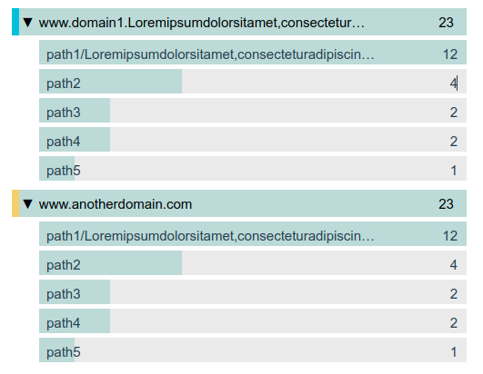
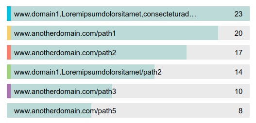

# vue-dropdown-newrelic

A Vue3 dropdown component that looks like New Relic HTTP Request statistics dropdown.

## Demo




## Useage
```javascript
<template>
  <div class="home">
    
    <DropdownMenu
      :dropdownArray="dropdownArray"
      :totalRecords="totalRecords"
      :btnLoadMore="btnLoadMore"
      @item-click="itemClick"
      @index-click="indexClick"
      @load-more-click="loadMoreClick"
    />
  </div>
</template>

<script>
import DropdownMenu from "@/components/dropdown_menu/DropdownMenu.vue";

export default {
  name: "Home",
  components: {
    DropdownMenu,
  },
  data() {
    return {
      dropdownArray: [
        {
          name: "www.domain1.Loremipsumdolorsitamet,consecteturadipiscingelit.",
          value: 23,
          percent: 100,
          subarr: [
            {
              name: "path1/Loremipsumdolorsitamet,consecteturadipiscingelit.",
              parent:
                "www.domain1.Loremipsumdolorsitamet,consecteturadipiscingelit.",
              value: 12,
              percent: 100,
            },
            {
              name: "path2",
              parent:
                "www.domain1.Loremipsumdolorsitamet,consecteturadipiscingelit.",
              value: 4,
              percent: 33.33,
            }
          ],
        },
        {
          name: "www.anotherdomain.com",
          value: 23,
          percent: 100,
          subarr: [
            {
              name: "path1/Loremipsumdolorsitamet,consecteturadipiscingelit.",
              parent: "www.anotherdomain.com",
              value: 12,
              percent: 100,
            },
            {
              name: "path2",
              parent: "www.anotherdomain.com",
              value: 4,
              percent: 33.33,
            }
          ],
        },
      ],
      totalRecords: 10,
      btnLoadMore: "Load more",
    };
  },
  methods: {
    itemClick(itemPayload) {
      console.log(itemPayload);
    },

    indexClick(indexPayload) {
      console.log(indexPayload);
    },
  },
};
</script>
```

## Props

|     Prop      	|                    Description                    	| Type   	| Default 	|
|---------------	|---------------------------------------------------	|--------	|---------	|
| dropdownArray 	| Data array used to display dropdown               	| array  	| null    	|
| totalRecords  	| The number of total records (used for pagination) 	| number 	| 0      	|
| btnLoadMore   	| Text of load more button                          	| string 	| "Load more" 	|

### Notes

There are 2 types of dropdownArray prop you can use. One with subarr field and one without it.

* When dropdownArray prop has subarr field, it represents the dropdown menu when you click on one of the dropdown buttons.

* When dropdownArray prop doesn't have subarr field, it simply just represents the array's value.

You should sort the percent field of the main array and also the sub array to achieve the desire results in demo (Basically it depends on sorting power from the server).

You can control the number of items per page as much as you want, this component does not provide default number of items per page.

## Events

| Name        	|                    Description                  	| Attributes              	|
|-------------	|-------------------------------------------------	|---------------------------------	|
| index-click 	| Emit when user clicked dropdown button               	| indexPayload                 	|
| item-click  	| Emit when user clicked one of the dropdown menu item 	| itemPayload 	|
| load-more-click  	| Emit when user clicked load more button 	|  	|

## Project setup
```
npm install
```

### Compiles and hot-reloads for development
```
npm run serve
```

### Compiles and minifies for production
```
npm run build
```

### Customize configuration
See [Configuration Reference](https://cli.vuejs.org/config/).
